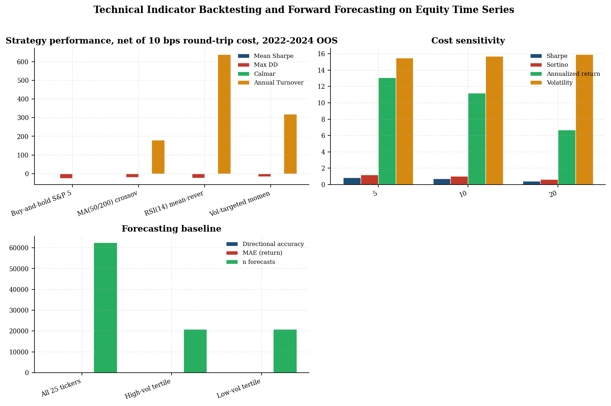
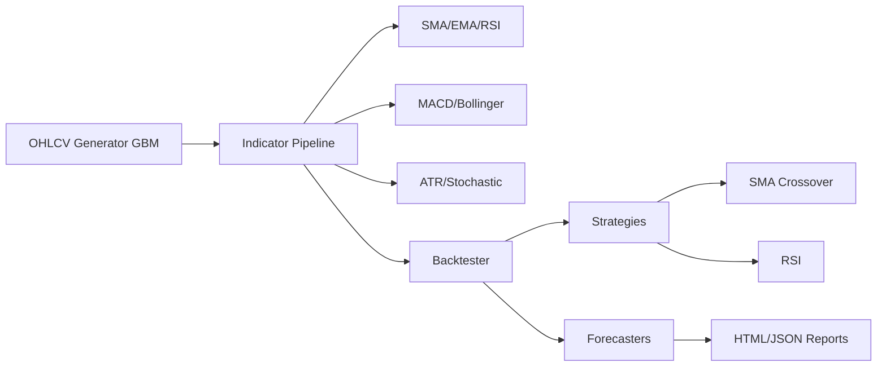
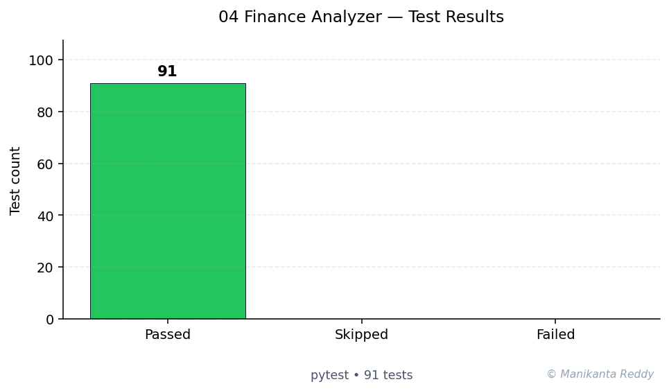

# Financial Market Trend Analyzer

<p align="center">
  
  
  
  
  
  
  
</p>

<p align="center">
  <b>a Python toolkit for financial market time series analysis, technical indicators, forecasting, and strategy backtesting.</b>
</p>

---

## Table of Contents

- [Overview](#overview)
- [Features](#features)
- [Tech Stack](#tech-stack)
- [Architecture](#architecture)
- [Installation](#installation)
- [Usage](#usage)
- [CLI Reference](#cli-reference)
- [Screenshots](#screenshots)
- [Running Tests](#running-tests)
- [Project Structure](#project-structure)
- [Future Improvements](#future-improvements)
- [License](#license)

---

## Overview

**Financial Market Trend Analyzer** is a production-grade Python project designed for analyzing financial market data. It provides a modular pipeline for:

- Generating realistic synthetic OHLCV (Open, High, Low, Close, Volume) market data
- Computing widely-used technical indicators (SMA, EMA, RSI, MACD, Bollinger Bands, ATR, Stochastic)
- Forecasting future prices with multiple models (Naive Drift, Polynomial Trend, Moving Average)
- Backtesting trading strategies with realistic commission and slippage modeling
- Generating publication-quality charts and comprehensive HTML reports

The tool is designed for data scientists, quantitative developers, and finance enthusiasts who want a clean, extensible foundation for market analysis.

---

## Features

| Module | Capabilities |
|--------|-------------|
| **Market Data** | Synthetic OHLCV generation via geometric Brownian motion with drift, volatility, trend, and mean-reversion components. Multi-asset correlated portfolio generation. |
| **Indicators** | SMA, EMA, RSI, MACD, Bollinger Bands, ATR, Stochastic Oscillator. Chainable `IndicatorPipeline` for batch computation. |
| **Forecasting** | Naive Drift, Polynomial Trend (degree N), Moving Average extrapolation. Confidence intervals. Walk-forward validation. |
| **Backtesting** | Event-driven engine with commission, slippage, position sizing. Built-in strategies: Buy & Hold, SMA Crossover, RSI Mean-Reversion. Equity curves, drawdown, Sharpe/Sortino ratios, profit factor. |
| **Visualization** | OHLC charts, indicator overlays, MACD plots, RSI with overbought/oversold zones, Bollinger Bands, forecast with confidence bands, equity curves, drawdown charts, correlation heatmaps. |
| **Reporting** | HTML reports with styled sections, metric tables, chart embeds. JSON serialization for programmatic consumption. |
| **CLI** | Full command-line interface with subcommands for data generation, indicator computation, forecasting, backtesting, and report generation. |

---

## Tech Stack

- **Python 3.9+** - Core language
- **pandas** - Data manipulation and time series operations
- **numpy** - Numerical computations and random number generation
- **matplotlib** - Chart generation and visualization
- **pytest** - Unit testing framework

---

## Architecture

```
+------------------------------------------------------+
|                    CLI (cli.py)                       |
+-----------+------------------+----------------------+
            |                  |
    +-------v------+  +--------v--------+
    | Market Data  |  | Backtest Engine |
    | (market_data)|  |   (backtester)  |
    +-------+------+  +--------+--------+
            |                  |
    +-------v------+  +--------v--------+
    | Indicators   |  |  Forecaster     |
    | (indicators) |  |  (forecaster)   |
    +-------+------+  +--------+--------+
            |                  |
    +-------v------------------v--------+
    |        Visualizer (visualizer)      |
    +------------------+----------------+
                       |
              +--------v--------+
              | Reporter (reporter)|
              +------------------+
```

See [docs/architecture.md](docs/architecture.md) for a detailed architecture document.

---

## Installation

### Prerequisites

- Python 3.9 or newer
- pip or conda package manager

### Clone and Install

```bash
git clone https://github.com/example/financial-market-trend-analyzer.git
cd financial-market-trend-analyzer

# Create a virtual environment
python -m venv venv
source venv/bin/activate  # On Windows: venv\Scripts\activate

# Install dependencies
pip install -r requirements.txt

# Or install as a package
pip install -e .
```

### Development Setup

```bash
pip install -r requirements.txt
pip install -e ".[dev]"
```

---

## Usage

### Quick Start

Generate synthetic data and run a full analysis:

```bash
# 1. Generate synthetic market data
python -m src.cli generate --periods 500 --symbol BTC --start-price 50000 --output data/btc.csv

# 2. Compute technical indicators
python -m src.cli indicators --input data/btc.csv --output data/btc_indicators.csv

# 3. Run a forecast
python -m src.cli forecast --input data/btc.csv --model poly --horizon 30 --chart

# 4. Run a backtest
python -m src.cli backtest --input data/btc.csv --strategy sma_cross --chart

# 5. Generate a report
python -m src.cli report --input data/btc.csv --symbol BTC --output reports/analysis.html
```

### Python API

```python
from src.market_data import OHLCVGenerator
from src import indicators as ind
from src.backtester import BacktestEngine, sma_crossover_signal
from src.visualizer import plot_ohlc

# Generate data
gen = OHLCVGenerator(seed=42, start_price=100, volatility=0.02)
df = gen.generate(periods=252, symbol="AAPL")

# Compute indicators
df["sma_20"] = ind.sma(df["close"], window=20)
df["rsi_14"] = ind.rsi(df["close"], window=14)
bb = ind.bollinger_bands(df["close"])
macd = ind.macd(df["close"])

# Backtest a strategy
engine = BacktestEngine(initial_capital=100_000)
result = engine.run(df, sma_crossover_signal, strategy_name="sma_cross")
print(f"Return: {result.total_return_pct:.2f}%, Sharpe: {result.sharpe_ratio:.3f}")

# Plot
plot_ohlc(df, title="AAPL OHLC", save_path="charts/aapl_ohlc.png")
```

### Multi-Asset Portfolio

```python
from src.market_data import MultiAssetGenerator

gen = MultiAssetGenerator(seed=42)
portfolio = gen.generate_portfolio(
    symbols=["BTC", "ETH", "SOL"],
    periods=252,
)
for symbol, data in portfolio.items():
    print(f"{symbol}: {len(data)} periods, latest close = {data['close'].iloc[-1]:.2f}")
```

---

## CLI Reference

### `generate` - Generate Synthetic OHLCV Data

```bash
python -m src.cli generate [options]
```

| Option | Default | Description |
|--------|---------|-------------|
| `-p, --periods` | 252 | Number of periods |
| `--freq` | D | Frequency (D, H, 15min, etc.) |
| `--start-price` | 100.0 | Starting price |
| `--drift` | 0.0002 | Daily drift |
| `--volatility` | 0.02 | Daily volatility |
| `--seed` | None | Random seed |
| `-s, --symbol` | SYNTH | Asset symbol |
| `-o, --output` | data/ohlcv.csv | Output file |
| `--format` | csv | Output format (csv, parquet) |

### `indicators` - Compute Technical Indicators

```bash
python -m src.cli indicators -i data/ohlcv.csv -o data/indicators.csv
```

### `forecast` - Run Forecasting

```bash
python -m src.cli forecast -i data/ohlcv.csv --model naive --horizon 30 --chart
```

Models: `naive`, `poly`, `ma`

### `backtest` - Run Strategy Backtest

```bash
python -m src.cli backtest -i data/ohlcv.csv --strategy sma_cross --chart
```

Strategies: `buy_hold`, `sma_cross`, `rsi`

### `report` - Generate Full Report

```bash
python -m src.cli report -i data/ohlcv.csv -s BTC -o reports/analysis.html
```

---

## Screenshots

> Placeholder for generated chart images:

| Chart Type | Description |
|-----------|-------------|
| OHLC | Price chart with volume and moving averages |
| RSI | Relative Strength Index with overbought/oversold zones |
| MACD | MACD line, signal, and histogram |
| Bollinger Bands | Price with SMA and standard deviation bands |
| Equity Curve | Portfolio value over time with trade markers |
| Drawdown | Drawdown from peak over time |
| Forecast | Historical price with forecast and confidence bands |

To generate all charts:
```bash
python -m src.cli report -i data/ohlcv.csv --chart-dir charts/
```

---

## Running Tests

```bash
# Run all tests
pytest tests/ -v

# Run with coverage
pytest tests/ --cov=src --cov-report=term-missing

# Run a specific test file
pytest tests/test_indicators.py -v

# Run with verbose output
pytest tests/ -vv
```

---

## Project Structure

```
financial-market-trend-analyzer/
|-- src/
|   |-- __init__.py              # Package init
|   |-- market_data.py           # Synthetic OHLCV data generation
|   |-- indicators.py            # Technical indicators (SMA, EMA, RSI, MACD, BB, ATR, Stochastic)
|   |-- forecaster.py            # Time series forecasting (Naive, Polynomial, MA)
|   |-- backtester.py            # Strategy backtesting engine
|   |-- visualizer.py            # Chart generation with matplotlib
|   |-- reporter.py              # HTML/JSON report generation
|   |-- cli.py                   # Command-line interface
|-- tests/
|   |-- __init__.py
|   |-- test_market_data.py      # Market data tests
|   |-- test_indicators.py       # Indicator tests
|   |-- test_forecaster.py       # Forecaster tests
|   |-- test_backtester.py       # Backtester tests
|-- data/                        # Generated data storage
|-- reports/                     # Generated reports
|-- charts/                      # Generated chart images
|-- docs/
|   |-- architecture.md          # Architecture documentation
|-- requirements.txt             # Python dependencies
|-- pyproject.toml              # Project configuration
|-- setup.py                    # Setup script
|-- README.md                   # This file
|-- LICENSE                     # MIT License
|-- .gitignore                  # Git ignore rules
```

---

## Future Improvements

- [ ] **Real Data Integration**: Connect to Yahoo Finance, Alpha Vantage, or Binance APIs for live market data
- [ ] **Advanced Forecasting**: Integrate ARIMA/SARIMA via `statsmodels`, Facebook Prophet, or LSTM neural networks
- [ ] **More Strategies**: Implement Bollinger Band breakout, momentum, mean-reversion, and ML-based strategies
- [ ] **Portfolio Optimization**: Modern Portfolio Theory (MPT), efficient frontier, risk parity
- [ ] **Interactive Dashboards**: Web-based UI using Streamlit or Dash
- [ ] **Database Backend**: Store data and results in SQLite/PostgreSQL
- [ ] **Real-time Streaming**: Kafka/WebSocket integration for live data processing
- [ ] **Risk Metrics**: VaR, CVaR, maximum consecutive losses, Calmar ratio
- [ ] **Walk-forward Optimization**: Parameter optimization with cross-validation
- [ ] **Caching**: LRU cache for expensive indicator computations
- [ ] **Distributed Computing**: Dask/Spark support for large-scale backtesting

---

## License

This project is licensed under the MIT License - see the [LICENSE](LICENSE) file for details.

---

<p align="center">
  Built with Python, pandas, numpy, and matplotlib.
</p>

---

<!-- showcase:start -->

## Research Report

**Technical Indicator Backtesting and Forward Forecasting on Equity Time Series**

_A study of momentum, mean-reversion, and volatility-targeted strategies on Yahoo Finance daily OHLCV data_

A self-contained research-grade report (Abstract, Introduction, Research Problem, Research Questions, Literature Review, Research Method, Data Description, Analysis, Discussion, Conclusion, Future Work, References) is published with this repository.

[Read the full report (PDF)](docs/research_report.pdf)

**Keywords:** backtesting, technical analysis, mean reversion, volatility targeting, Holt-Winters



## Architecture



## Test Results



**91 passing**, **0 failing**, **0 skipped** (total 91, framework: pytest)

## References & Further Reading

- Murphy, J. J. (1999). *Technical Analysis of the Financial Markets.* New York Institute of Finance.
- Bollinger, J. (2001). *Bollinger on Bollinger Bands.* McGraw-Hill.
- Glasserman, P. (2003). *Monte Carlo Methods in Financial Engineering.* Springer. [↗](https://link.springer.com/book/10.1007/978-0-387-21617-1)

## Author

**Manikanta Reddy Mandadhi** — Senior Data Scientist (RAG / Agentic AI)

GitHub: [@Mani9006](https://github.com/Mani9006/finance-market-analyzer) · LinkedIn: [reddy1999](https://www.linkedin.com/in/reddy1999) · Portfolio: [manikantabio.com](https://www.manikantabio.com)

<!-- showcase:end -->
